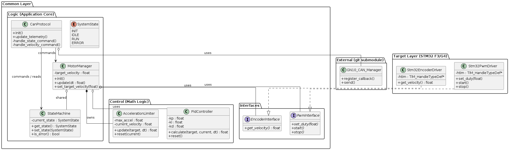

# HTMDv2.2FW

Gento Aiba(GN10)が開発しているモータードライバーのファームウェアです。

HTMDとはHaruto Tanakaが作成したモータードライバーです。
このリポジトリにはHTMDv2.2cという基板のファームウェアが入っています。

HTMDv2.2cはSTM32F303K8T6と、STM32G431K8T6の2つのMCUに対応しているので、それぞれのMCU用に計２つのファームウェアがあります。

## Class Diagram

