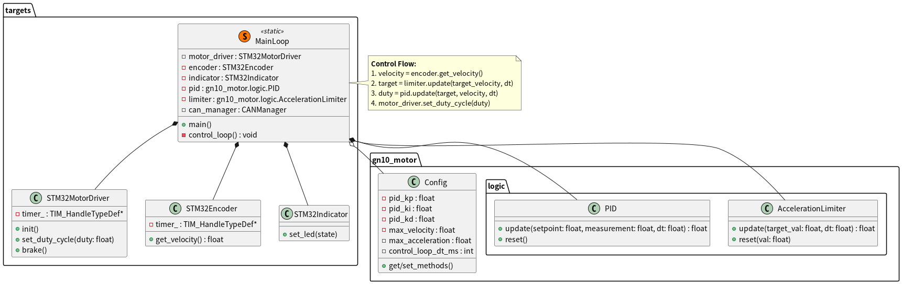

# gn10-motor

[English](README.md) | [日本語](README_ja.md)

This repository contains firmware for the [HTMDv2.2c](https://github.com/ararobo/HTMDv2.2c) and [HTMDv2.2s](https://github.com/ararobo/HTMDv2.2s) boards.

HTMDv2.2c supports two MCUs: STM32F303K8T6 and STM32G431K8T6. HTMDv2.2s supports STM32G431CEU6.

## Documentation

| Document | Description |
| :-: | :-: |
| [CONTRIBUTING.md](./CONTRIBUTING.md) | Development flow, commit conventions, coding rules |
| [docs/coding-rules.md](./docs/coding-rules.md) | Detailed coding rules |

## Development Environment Setup

### Common
Install **CMake Tools** extension for VSCode.

### Ubuntu
```bash
sudo apt update
sudo apt install -y build-essential cmake ninja-build gcc-arm-none-eabi gdb-multiarch
```

### Windows(for STM32)

Install STM32CubeCLT.

## Build

for STM32F303K8T6 (HTMDv2.2c-f303):
```bash
cmake --preset HTMDv2.2c-f303-debug
cmake --build --preset HTMDv2.2c-f303-debug
```
for STM32G431K8T6 (HTMDv2.2c-g431):
```bash
cmake --preset HTMDv2.2c-g431-debug
cmake --build --preset HTMDv2.2c-g431-debug
```
for HTMDv2.2s:
```bash
cmake --preset HTMDv2.2s-debug
cmake --build --preset HTMDv2.2s-debug
```

## Class Diagram



## Contributing

See [CONTRIBUTING.md](./CONTRIBUTING.md) for details.

## License
This project is licensed under the Apache-2.0 - see the [LICENSE](LICENSE) file for details.